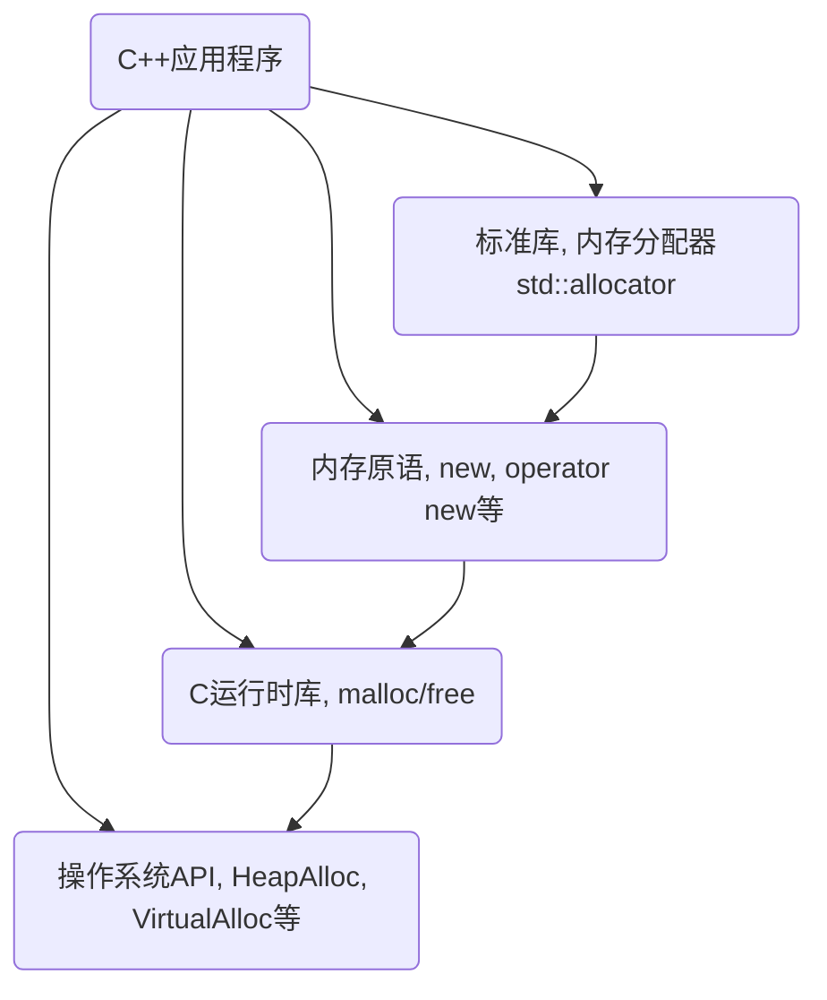

## C++应用程序的内存分配流程图


## C++ 内存原语
| 分配 | 释放 | 类属 | 可否重载 |
| :----------- | :----------- | :----------- | :----------- |
| malloc() | free() | C函数 | 不可 |
| new | delete | C++表达式 | 不可 |
| ::operator new() | ::operator delete() | C++函数 | 可 |
| allocator`<T>`::allocate() | allocator`<T>`::deallocate() | C++标准库 | 可自由设计并以之搭配任何容器 |

```C++
    // malloc free
    void* p1 = malloc(512); // 512 bytes
    free(p1);

    // new delete
    complex<int>* p2 = new complex<int>; // one object
    delete p2;

    // ::operator new() ::operator delete()
    void* p3 = ::operator new(512); // 512 bytes
    ::operator delete(p3);

    // allocator
    void* p4 = allocator<int>().allocate(7); // 7 ints
    allocator<int>().deallocate((int*)p4, 7);
```

### new 表达式

```C++
Complex* pc = new Complex(1,2);
    编译器      |
    转化为      |

    Complex* pc;
    try {
        void* mem = operator new(sizeof(Complex)); // operator new()下调用了malloc进行内存分配
        pc = static_cast<Complex*>(mem);           // 转换void* -> Complex*类型
        pc->Complex::Complex(1,2);                 // 只有编译器才可以直接通过指针调用构造函数，正常情况使用placement new调用构造函数, new(p)Complex(1,2);
    }
    catch (std::bad_alloc) {
        // 若分配在operator new下分配内存失败，则不执行构造函数
    }
```

### delete 表达式

```C++
    Complex* pc = new Complex(1,2);
    ...
    delete pc;
      | 编译器转化为
      |
    pc->~Complex();      // 先析构
    operator delete(pc); // 然后释放内存，operator delete下调用了free进行内存的释放
```